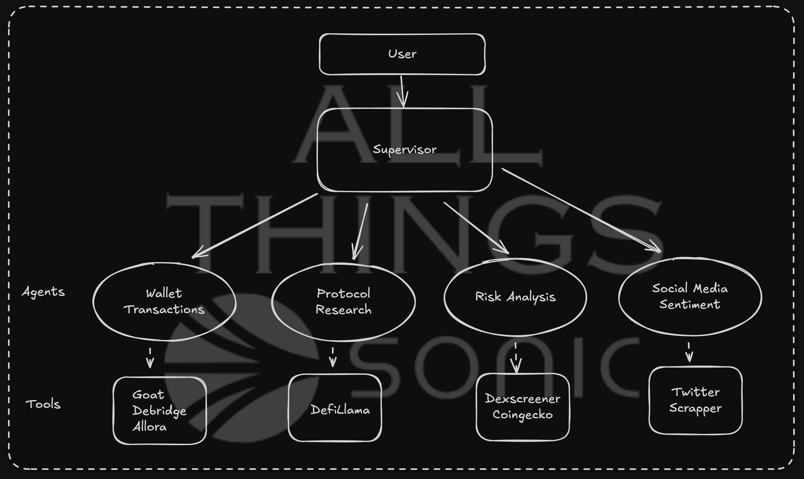

# 🚀 ALL THINGS SONIC
One Stop for ALL THINGS SONIC: Regular updates and weekly recaps on Socials, DeFi tasks from the agent.

Made with ❤️ by Shrey Ganatra for Sonic DeFAI Hackathon

## 📌 Overview

This project integrates multiple AI-powered tools and blockchain-based connections to create a **Multi-Agent Supervisor** system. The system is capable of scraping data, processing information, and executing AI-driven actions. 

## ⚙️ Social Agent
- **Twitter Scraper** → Extracts search results and posts from Twitter.
  Say Bye 👋 to Rate Limits!
- **Daily Loop**: Fetches the latest updates on **Sonic** and posts them to Twitter.
- **Weekly Recap**: Aggregates all updates from the week and posts a recap about **ALL THINGS SONIC**.
- **Chat with Agent**: Chat with the agent to get the latest tweets about any topic or post a tweet with help of the agent.

## 🔥 Tools Added

1. **Twitter Scraper** → Extracts search results and posts from Twitter.
  Say Bye 👋 to Rate Limits!
2. **DefiLlama Connection** → Retrieves protocol-related data from DefiLlama.
3. **WebPage Connection** → Fetches and processes any webpage information.
4. **Retrieval Augmented Generation** → Retrieves information from the Sonic whitepaper and uses it to answer questions.

## DeFi Agent
**LangGraph Multi-Agent Supervisor** → Manages and orchestrates multiple AI agents for advanced task automation.



## 🔗 Integrations

- **Sonic** → AI-driven actions.
- **Debridge** → Cross-chain interactions.
- **ZerePy** → AI framework integration.
- **Goat** → On-chain action execution with support for:
  - CoinGecko
  - Dex Screener
  - Allora


## 🎯 Use Cases

- **Crypto Market Analysis**: Aggregating data from DeFi protocols and price tracking services.
- **AI-Driven Trading Bots**: Executing on-chain actions based on real-time data.
- **Web Scraping & Intelligence**: Gathering insights from social media and websites.
- **Automated Multi-Agent Workflows**: Managing AI agents to perform diverse tasks.

## 🚀 How to Run

1. Clone the repository:
   ```bash
   git clone https://github.com/ShreyGanatra/All-Things-Sonic.git
   cd All-Things-Sonic
   ```
2. Install dependencies:
   ```bash
   poetry install --no-root
   ```
3. Run the Multi-Agent Supervisor:
   ```bash
   poetry run python main.py
   ```
4. Configure API keys for integrations in `.env` file.
   ```bash
   cp .env.example .env
   ```

## 📜 Future Enhancements

- More integrations with DeFi & Web3 protocols.
- Enhanced AI-driven decision-making.
- Real-time automation & event-driven triggers.


